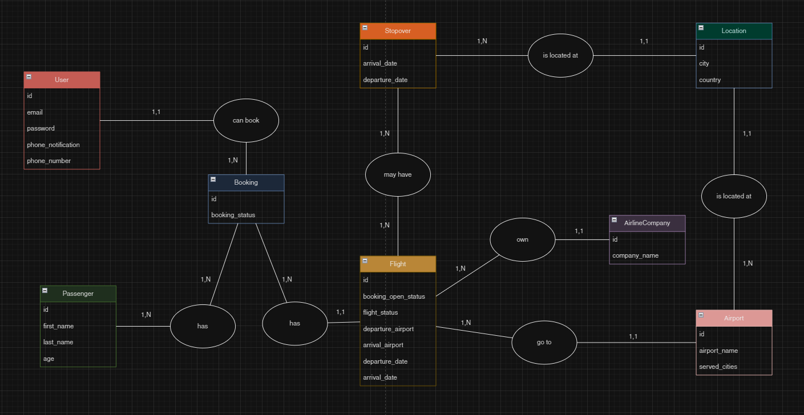
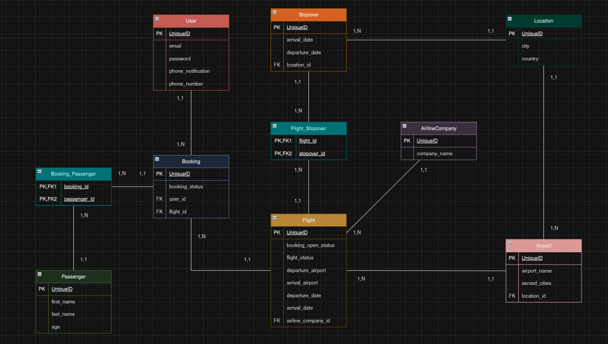
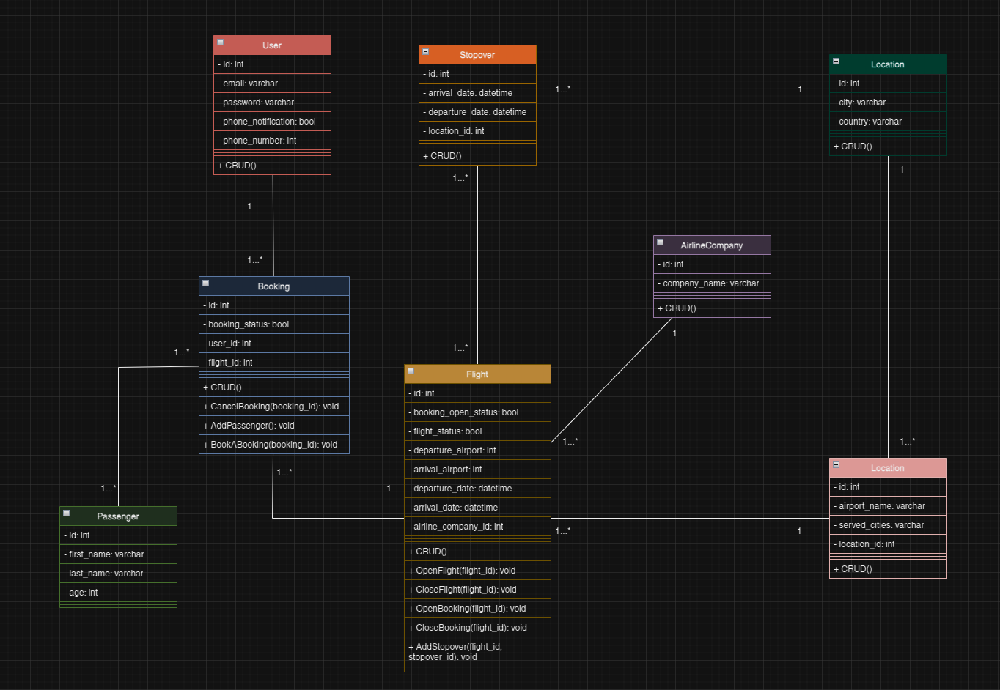
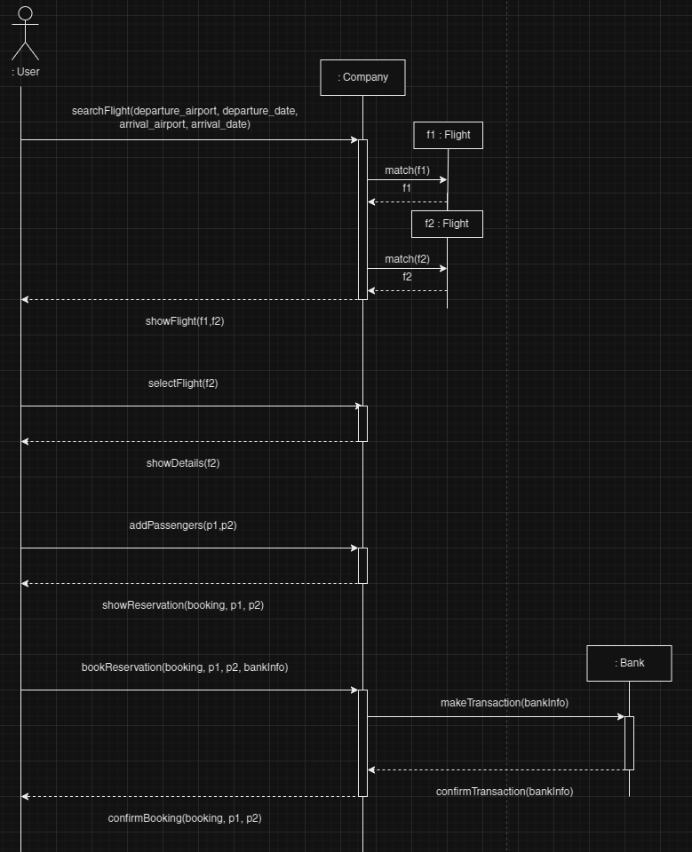

# FIRST STEPS

You can find here differents files about my work on conception for the total recall project : 

MCD :  

  

MLD :  

  

Class diagram :  

  

Sequence diagram :   

 

[MPD and data dictionnary](https://raw.githack.com/2024-avril-devops-alt-dist/nicow-total-recall-project/main/MPD_dictionnary.html)  

[SQL](./db.sql)  

If you can't access them, use the links below can help a lot.

# LINKS

- [Google Sheet for MPD & data dictionnary](https://docs.google.com/spreadsheets/d/1P7VuC5tU57I0yT8wnqwRSdMj5GCcc4rt_mBVD0b08hg/edit?usp=sharing)
- [Draw.io for all the diagrams](https://drive.google.com/file/d/1ltGjXupSwFz5HJiRpev0LIibiMEKLNyt/view?usp=sharing) (may be hard to see correctly because of the size)
